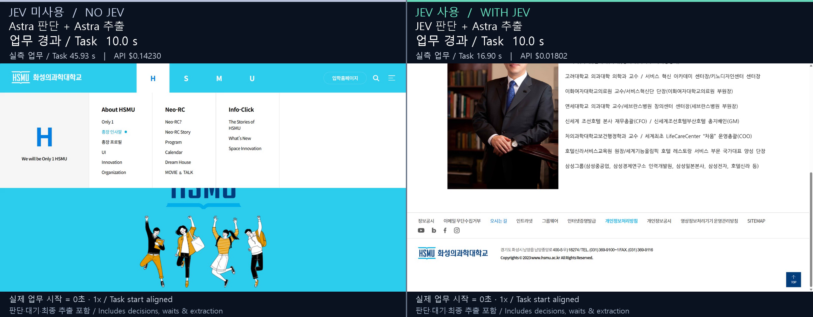

# JEV Agent Router

**Reuse a decision, call JEV or ask an LLM. Inspect the handoff, cost and task result.**

**같은 판단은 재사용하고, 새 판단은 JEV·LLM 중에서 선택합니다. 업무 인계·비용·실행 결과까지 확인하는 로컬 라우터입니다.**

[English installation](docs/INSTALL.en.md) · [한국어 설치 안내](docs/INSTALL.ko.md) · [Live demo guide](docs/DEMO.en.md) · [데모 안내](docs/DEMO.ko.md) · [Measured results](benchmarks/results/complex-missions-v1/RESULTS.md) · [Raw report](benchmarks/results/complex-missions-v1/report.json)

## Why this repo / 이 저장소의 차별점

**The distinguishing focus is the combination: JEV + LLM + cache selection, verifiable task handoffs, and published workflow evidence in one repository.** Bring your task, evidence and available workers or tools through a JSON CLI or Node API; your existing agent keeps control of execution. Optional skills teach Codex and Claude how to call the runtime.

**차별점은 JEV·LLM·캐시 선택, 검증 가능한 업무 인계, 실제 업무 비교 근거를 한 저장소에 묶었다는 점입니다.** 기존 에이전트가 업무·근거·사용 가능한 담당과 도구를 전달하면 다음 경로를 권고합니다. 같은 JSON CLI·Node API를 사용하고, 실행은 기존 에이전트가 맡습니다.

| What you gain / 얻는 것 | How it works and evidence / 구현과 근거 |
|---|---|
| **Reuse before paying again / 같은 판단의 재호출 줄이기** | A valid exact match returns without a new model call. Prompt-cache observations are tracked separately. Six published exact replays made **zero new API calls**. / 동일 입력·설정·범위·유효기간이 맞으면 결과를 재사용합니다. 프롬프트 캐시와 구분하며, 공개 실험의 정확 재생 6건은 새 호출이 0회였습니다. [Results / 결과](benchmarks/results/complex-missions-v1/RESULTS.md) |
| **Choose the decision model / 판단 모델까지 선택하기** | Adaptive routing chooses JEV, Luna or Astra using host-supplied difficulty and scoped cost/cache observations, with bounded escalation when a model abstains. / 호스트가 지정한 난도와 비용·캐시 관측으로 판단 모델을 선택하고, 판단 보류 시 정해진 한도 안에서 상위 모델로 넘깁니다. [Policy / 정책](docs/adaptive-routing.md) |
| **Validate before handing off / 오래된 인계와 중복 유료 호출 방지** | The separate durable task API checks the current input, committed ledger and handoff, rejects older known task revisions, and preserves interrupted calls for review. / 별도 업무 인계 API는 현재 입력·원장·인계 파일의 일치 여부와 최신 revision을 확인합니다. 결과 미상인 유료 호출을 자동 반복하지 않습니다. [Handoffs / 인계](docs/task-router.md) |
| **Inspect the whole workflow / 완료·실패·전체 비용을 함께 비교** | No-JEV LLM controls, the same cache opportunities, completion checks, failed attempts and costs are published. Browser videos share the actual task-start zero and include decisions, waits and final extraction. / JEV 미사용 대조군과 같은 캐시 기회로 비교하며, 완료 검증·실패·비용을 공개합니다. 영상은 실제 업무 시작점을 맞추고 판단·대기·최종 추출을 포함합니다. [Video and all attempts / 영상과 모든 시도](benchmarks/results/browser-task-aligned-20260924/RESULTS.md) |

**Use it when** your agent repeatedly chooses among known workers or tools and you want to compare decision cost, reuse and outcomes before expanding automation. The adaptive live experiment used JEV for every fresh routing call; warm-Luna selection and Astra escalation are implemented and mock-tested. The Claude in Chrome path was live-tested on two local fixtures ([results](benchmarks/results/claude-chrome-live-20260924/RESULTS.md)); on three real public-site tasks it completed 0 of 7 attempts while Opus 5.5 alone completed 6 of 6; a later third arm, in which Opus 5.5 launched an isolated, signed-out Playwright JEV loop following an experimenter-written plan, completed 5 of 6 registered attempts with less mean time and Opus cost in this pilot ([A/B](benchmarks/results/claude-ab-20260925/RESULTS.md)). Grok integration remains unverified. The durable handoff API and adaptive cache have distinct contracts; a recommendation does not execute a worker or grant permission.

**이런 경우에 적합합니다:** 정해진 담당·도구 중 하나를 반복해서 고르는 업무에서, 자동화 범위를 늘리기 전에 판단 비용·재사용·실제 결과를 확인하고 싶을 때입니다. 적응형 실측에서는 새 판단에 모두 JEV가 선택됐으며, Luna 캐시 선택·Astra 위임은 모의 테스트로 검증했습니다. Claude in Chrome 경로는 로컬 예제 두 개로 실제 검증했지만([결과](benchmarks/results/claude-chrome-live-20260924/RESULTS.md)), 실사이트 과제 3종에서는 Opus 5.5 단독 6/6, Chrome 브리지 0/7이었고, 나중에 추가한 세 번째 조건(실험자가 쓴 계획을 따르는 격리·비로그인 Playwright JEV 루프)은 등록 시도 6회 중 5회를 완료했습니다([비교](benchmarks/results/claude-ab-20260925/RESULTS.md)). Grok 실기 검증은 남아 있습니다. 적응형 캐시와 업무 인계 API의 계약은 별개이고, 추천만으로 작업이 실행되거나 권한이 생기지는 않습니다.

[Compared with TypeSafe Mario, Jev Codex Router, Typesafe MCP, Newsjack and Canny / 관련 저장소와의 용도 비교](docs/COMPARISON.md). The comparison explains scope and shared ideas; it makes no claim that these features are exclusive or that this project outperforms those repositories.

## What this does

A host such as Codex or Claude supplies a task, current evidence, and a finite list of available tools or workers. The router recommends one route. It does not execute the selected worker, send messages, connect a bot, or grant permission to publish.

- **Adaptive routing:** reuse a valid exact result; otherwise select JEV, Luna, or Astra using host-supplied difficulty and scoped cost/cache observations. A semantic abstention can escalate once to Astra within the configured limits.
- **Durable task routing:** shadow comparison, active local handoff files, and an offline handoff reader that checks the committed ledger against the current input.
- **Bounded browser helpers:** adapters for a host's existing Codex browser session and a Claude in Chrome decision/authorization/verification bridge with a session ledger. The Claude path was **live-tested** with Claude Code and the Claude in Chrome extension on two local fixtures, but **did not complete real public-site tasks** in a pre-registered A/B. A third arm registered afterwards, an isolated Playwright JEV loop launched by Claude and following an experimenter-written plan, completed 5 of 6 registered attempts (2 of 3 extra attempts after a harness fix); see [Claude in Chrome](#claude-code--claude-in-chrome).
- **Accounting:** record calls, observed token usage, provider cost estimates or reported credit charges, cache reuse, and uncertain outcomes. Unknown costs remain `null`.

This is a local Node.js runtime with optional host skills, not a replacement for Codex, Claude, or their browser tools. A skill tells the host how to use the runtime; installing it does not install API credits or establish a browser connection.

## Actual Chrome task recordings / 실제 Chrome 작업 영상

**Actual task starts aligned:** left **NO JEV — Astra**, right **WITH JEV — JEV + Astra**. Both timers start before the first model decision and include all waiting and final extraction. These are fresh recordings made on 2026-09-24, presented at 1× with 40 ms frame quantization.

**실제 업무 시작점을 0초로 맞췄습니다.** 왼쪽은 JEV 미사용, 오른쪽은 JEV 사용입니다. 첫 판단 전부터 마지막 추출까지 포함하고, 완료된 쪽의 시계만 멈춥니다. 준비·정리는 별도이며 영상 표시 단위는 0.04초입니다.

[▶ Play aligned comparison / 업무 시작 정렬 영상](benchmarks/results/browser-task-aligned-20260924/comparison/comparison.mp4) · [All attempts, cost and original videos / 모든 시도·비용·원본](benchmarks/results/browser-task-aligned-20260924/RESULTS.md) · [Reproduce](docs/BROWSER-DEMO.en.md) · [재현 방법](docs/BROWSER-DEMO.ko.md)

[](benchmarks/results/browser-task-aligned-20260924/comparison/comparison.mp4)

| Completed run / 완주 실행 | JEV used? / JEV 사용? | Task / 업무 | Full run / 준비·정리 포함 | Provider cost / 비용 |
|---|---|---:|---:|---:|
| Astra attempt 1 / 1차 | No / 미사용 | 45.93 s | 85.52 s | $0.14230000 |
| JEV attempt 2 / 2차 + Astra | Yes / 사용 | 16.90 s | 52.00 s | $0.01801860 |

**Attempt outcomes: Astra 1/1 completed, JEV 1/2 completed.** JEV's first attempt stopped at LOW_CONFIDENCE; the video selects the two completed runs. All 18 new requests, including failure, cost **$0.161084974** on the recorded provider accounting basis. This bounded pilot does not establish general speed or reliability. OpenRouter-reported costs and JEV token-price estimates exclude host inference, fees and tax.

**완주 횟수는 Astra 1/1, JEV 1/2입니다.** JEV 1차는 확신도 부족으로 중단됐으며, 영상에는 완주한 두 실행을 사용했습니다. 실패분을 포함한 새 호출 18회의 비용은 **$0.161084974**입니다. 이전 파일럿의 수치와 섞지 않았고, 이 소규모 결과를 일반적인 우위로 해석하지 않습니다.

[Earlier pilot and replay-only comparison / 이전 파일럿·재생 시작 정렬 영상](benchmarks/results/browser-playwright-20260924/RESULTS.md) remain available unchanged.

## Claude Code + Claude in Chrome

**Claude can now be the host.** Install the Claude-only skill with `node -- scripts/install-skill.mjs --agent claude --skill claude-chrome`, start `claude --chrome`, and ask Claude to use `jev-claude-chrome`. Claude reads the tab with the official extension tools, JEV proposes one host-approved action, a local session ledger authorizes it, Claude executes it once, and the ledger verifies it from a fresh read.

**Claude도 호스트로 사용할 수 있습니다.** `--agent claude --skill claude-chrome`으로 Claude 전용 스킬을 설치하고 `claude --chrome`에서 `jev-claude-chrome` 사용을 요청하면 됩니다.

| Release run (2026-09-24 UTC) | Result | Steps | JEV requests | JEV cost | Wall clock |
| --- | --- | ---: | ---: | ---: | ---: |
| Two-click demo | completed, first attempt | 2 | 3 | $0.000185 | 163 s |
| Korean notice search: type → search → filter → open the 2026 notice | completed, first attempt | 4 | 5 | $0.000576 | 249 s |

The wall clock is mostly Claude's own tool round trips (about 30–60 s per action); no speed advantage is claimed. Development attempts before a four-round review stopped at the confidence gate or a timing window and are listed with their reasons in [the live results](benchmarks/results/claude-chrome-live-20260924/RESULTS.md). The review checked the bridge against the installed extension's source; see [the contract and known limitations](docs/claude-chrome.md).

**Real-site A/B (2026-09-25).** Three tasks on public sites (a GitHub repository in English, a scholarship notice and the earlier ordered-visit task on a Korean university site), graded from transcripts, ledgers and harness records. The two Chrome arms ran 03:49–04:50 KST; the Playwright arm was registered and run afterwards (10:20–10:34 KST) and compared with them without re-running them:

| Arm (Claude Opus 5.5 host) | Completed | Mean agent time | Comparable time¹ | Mean Opus cost (API list price) | JEV cost |
| --- | ---: | ---: | ---: | ---: | ---: |
| Opus only, Claude in Chrome tools | 6/6 | 80 s | 80 s | $0.44 | — |
| Opus + JEV, Claude in Chrome bridge (incl. one extra attempt) | 0/7 | 277 s | 277 s | $1.28 logged (≈$1.34²) | $0.0026 for 12 requests |
| Opus + JEV, isolated Playwright loop (registered) | 5/6 | 65 s, ≈30 s of it an exit-delay bug | 54 s | $0.23 | $0.0067 for 28 requests |
| same loop after the fix (extra) | 2/3 | 29 s | 21 s | $0.20 | $0.0031 for 13 requests |

¹ Agent time minus browser launch and pop-up preparation, which the parent session did untimed for the Chrome arms; this is the Playwright protocol's registered primary time. ² Including output tokens estimated where the final usage was not logged.

With Claude in Chrome the host has to read every page and re-type it for the ledger, so the bridge was slower and costlier than Opus alone and stopped on text-heavy pages, closing menus, the 0.75 confidence gate and a minimized Chrome window. In the Playwright arm Opus ran one command ([`benchmarks/claude-playwright-goal.mjs`](benchmarks/claude-playwright-goal.mjs)); Node drove an isolated headless Chrome and JEV chose every click in 0.2–1.1 s, so the whole browsing loop took 7–17 s and Opus spent 9–13 s. Its two failures were JEV confidence 0.73 and 0.69 on the same step. The JEV arms follow a plan the experimenter wrote (not counted in time or cost), and the Playwright browser is isolated and signed out. In this small pilot Opus alone was the only arm without failures, and the Playwright loop used less mean time and Opus cost; neither is a general claim. [Results, all attempts, protocols and disclosures](benchmarks/results/claude-ab-20260925/RESULTS.md)

**실사이트 비교(2026-09-25).** Opus 5.5 단독 6/6(평균 80초, $0.44), Chrome 브리지 0/7(277초, $1.28), 나중에 추가한 격리 Playwright JEV 루프는 등록 시도 5/6(평균 65초, 이 중 약 30초는 실행기 종료 지연 버그)과 수정 후 추가 시도 2/3(29초, $0.20)입니다. Chrome 브리지는 Claude가 모든 페이지를 읽고 옮겨 써야 해서 느렸습니다. Playwright 루프는 Opus가 명령 한 번만 실행하고 Node와 JEV가 클릭을 처리해 7~17초에 탐색을 끝냈습니다. 실패 2회는 같은 단계의 확신도 기준 미달이었습니다. JEV 조건은 실험자가 쓴 계획을 따르고, Playwright 브라우저는 로그인되지 않은 격리 환경입니다. 소규모 실험이므로 일반적인 우위로 해석하지 않습니다. [결과·모든 시도·프로토콜](benchmarks/results/claude-ab-20260925/RESULTS.md)

## Measured synthetic workflow comparison

On 2026-09-24, two Korean **synthetic** missions covered scholarship allocation and public-grant selection. Each had a base case and changed evidence. Every arm selected local evidence and used **Astra for final structured synthesis**. All arms received the same exact-cache and prompt-cache opportunities.

| Arm / 방식 | JEV used? / JEV 사용? | Core checks, fresh workflows | Strict checks including citations | Mean fresh workflow time | Cost of 4 fresh workflows |
| --- | --- | ---: | ---: | ---: | ---: |
| Astra routing + Astra synthesis | No / 아니요 | 4/4 | 4/4 | 12.996 s | $0.26512300 |
| Luna routing + Astra synthesis | No / 아니요 | 4/4 | 4/4 | 12.735 s | $0.21389040 |
| Adaptive (JEV in this run / 이번 실행은 JEV) + Astra | Yes / 예 | 4/4 | 3/4 | 11.196 s | $0.21446232 |

The adaptive arm selected JEV for every fresh routing call in this run. Adaptive routing can choose JEV, Luna or Astra; it does not always use JEV. Its automatic warm-Luna selection and Astra escalation are covered by mock tests, not demonstrated by these live results. The adaptive arm had the lowest observed mean time; Luna + Astra had the lowest observed total cost. These are descriptive results from four fresh workflows per arm, not evidence of general superiority.

**JEV 사용 여부:** Astra·Luna 대조군은 JEV를 사용하지 않았습니다. 적응형은 이번 실행의 새 자료 선택 호출에 모두 JEV를 사용하고 최종 산출물은 Astra가 작성했습니다. 적응형은 조건에 따라 Luna·Astra도 선택할 수 있으므로 항상 JEV를 쓰는 방식은 아닙니다. 정확 결과 재생에는 새 모델 호출이 없습니다.

There were **12 fresh workflows, 6 exact replays, and 36 actual POST requests**. Each exact replay added zero model requests and zero provider cost. Changed evidence caused new synthesis; unchanged routing subtasks could reuse their own exact result. The total **$0.69347572** combines JEV input list-price estimates with OpenRouter-reported credit charges. It excludes host inference, funding fees, taxes, and downstream tools; it is not a card bill.

The one strict failure was a final-step citation-set mismatch. An independent agent review found that the supplied citations supported that step, but the **frozen score remains 11/12 strict, 12/12 core**. The fixtures are agent-authored development cases, not a human-validated benchmark. See the [full conditions](benchmarks/results/complex-missions-v1/RESULTS.md), [interpretation](benchmarks/results/complex-missions-v1/INTERPRETATION.md), [frozen manifest](benchmarks/results/complex-missions-v1/report.json.manifest.json), and [verification record](benchmarks/results/complex-missions-v1/verification.json).

Current release verification: **976 automated tests passed, zero failures** (794 before the Claude in Chrome work, 961 before the Playwright A/B harness; in one earlier full run on Windows, a pre-existing router-task test failed once intermittently, then passed alone and in every later full run). The original synthetic run records 718 tests before inference and 722 after the first router refinements. Run `npm run test:all` to verify your installed revision.

A read-only live progress dashboard and bilingual recording instructions are included. The synthetic results above come from their preserved API report; the real Chrome recordings are a separate experiment linked earlier in this README.

## Quick start

Requirements: **Node.js 24+**, npm, and a local writable directory. Run these commands from the repository root. No browser or API key is needed for offline checks.

```sh
npm ci
npm run test:all
node -- src/adaptive-router-cli.mjs --preflight --input examples/adaptive-router-task.json --config examples/adaptive-router-config.json
node --use-system-ca -- benchmarks/complex-mission-eval.mjs --preflight
```

For live use, create a private `.env` from `.env.example` and enter your own `TYPESAFE_API_KEY` and `OPENROUTER_API_KEY` in a local editor. They are separate provider credentials; a host subscription or `OPENAI_API_KEY` does not substitute for them. Keep keys out of prompts, command arguments, screenshots, and Git. [Detailed setup and troubleshooting →](docs/INSTALL.en.md)

```sh
# Paid decision; the example limits one decision to at most 2 POSTs.
node --use-system-ca -- src/adaptive-router-cli.mjs --live --input examples/adaptive-router-task.json --config examples/adaptive-router-config.json --state-dir .jev-router-adaptive --env-file .env

# Optional: teach both hosts to use this checkout's adaptive router.
node -- scripts/install-skill.mjs --agent both --skill adaptive
```

`selected` means a recommendation is available. The host still checks `requiresHostApproval`, current evidence, tool availability, and user authorization before using its own execution tools. `needs_host` means stop and inspect the reason; do not hide it with a retry loop.

## Cache and cost boundaries

- **Exact result cache:** identical normalized input, policy, model/configuration, namespace and scope within the accepted TTL. It is not a semantic cache. Changed evidence or configuration invalidates the match.
- **Prompt cache:** reuse of a stable provider-side prefix; dynamic evidence and generated output still require inference. A recent observation is not a guaranteed future cache hit.
- **Freshness:** the host must supply updated evidence. The adaptive cache does not enforce monotonic task revisions; replaying an old snapshot can return its old result within TTL. Use the durable task handoff API when a latest-revision check is needed.
- **Limits:** `maxCalls` caps actual POSTs for one adaptive decision. `budgetUsd` is an estimated-cost dispatch threshold, not a provider-enforced prepaid cap. The benchmark additionally reserves estimated cost across the run.
- **Uncertainty:** an interrupted, timed-out, or unaccounted attempt is not automatically retried. Private state and locks preserve the need for host review.

See [adaptive routing](docs/adaptive-routing.md), [task routing and handoffs](docs/task-router.md), and the [Node exports](src/index.mjs). Local state directories can contain task evidence; keep them private even though the software repository is public.

## 한국어

호스트가 업무·현재 근거·실제로 사용할 수 있는 도구 목록을 전달하면, 라우터가 다음 경로를 권고합니다. 동일 입력 결과를 재사용하고, 새 판단은 업무 난도와 최근 비용·캐시 관측에 따라 JEV/Luna/Astra 중에서 선택합니다. 모델은 임의의 도구나 실행 권한을 만들 수 없습니다.

**스킬과 실행 엔진은 별개입니다.** 스킬은 Codex·Claude에게 이 저장소의 명령을 사용하는 절차를 알려 줍니다. Node 실행 엔진과 API 키는 로컬에 따로 준비해야 하며, 스킬 설치만으로 브라우저·봇이 연결되거나 선택된 업무가 자동 실행되지는 않습니다. Claude in Chrome 경로는 Claude Code가 호스트가 되어 로컬 예제 두 개를 실제로 완료했지만 실사이트에서는 완료하지 못했고, 나중에 추가한 조건에서 Claude가 실행한 격리 Playwright JEV 루프는 실험자가 쓴 계획으로 등록 시도 6회 중 5회를 완료했습니다([비교](benchmarks/results/claude-ab-20260925/RESULTS.md)). Claude 전용 스킬은 `--agent claude --skill claude-chrome`으로 설치합니다.

위 실험에서는 새 업무 12건의 핵심 판단·계산·마감·승인 조건이 모두 맞았고, 인용까지 포함한 엄격 검사는 11/12였습니다. 정확 재생 6건의 추가 호출·비용은 0이었습니다. 적응형이 이번 평균 시간은 가장 짧았지만 비용은 Luna+Astra가 조금 더 낮았습니다. 이 작은 합성 평가를 모든 실제 업무의 정확도·속도·비용 우월성으로 일반화하지 않습니다.

[국문 설치 안내](docs/INSTALL.ko.md)에 키 준비, 오프라인 검사, 유료 실행, Codex·Claude 스킬 설치, 캐시와 오류 처리 방법을 정리했습니다. 공개 결과의 시간은 전체 로컬 업무 흐름을 측정하며, 프롬프트 캐시를 답안 재사용이나 무료 실행과 혼동하지 않습니다.

## Reproduce the paid benchmark

Run offline preflight first. Use a new output path; existing reports are never overwritten. This command sends synthetic evidence to TypeSafe and OpenRouter and can incur charges.

```sh
node --use-system-ca -- benchmarks/complex-mission-eval.mjs --live --env-file .env --output benchmarks/results/my-complex-run/report.json --budget-usd 5 --max-requests 80
```

The published run used 36 requests and approximately $0.69348 in the stated accounting scope. A rerun can differ in latency, output, cache hits, and cost; the configured $5 reservation is not a promise of the bill. The benchmark creates local analysis artifacts only. It does not submit applications, operate a browser, or record a screen video.
