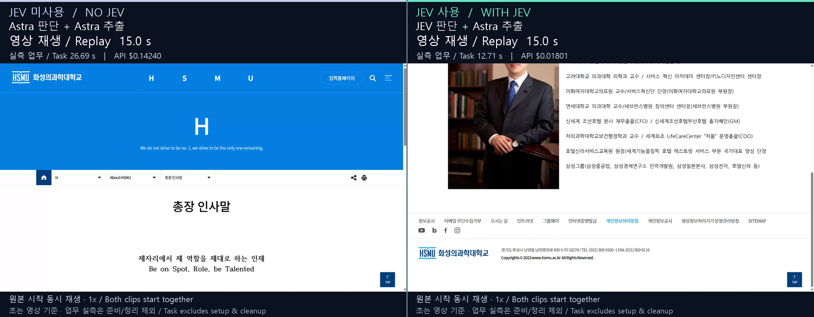
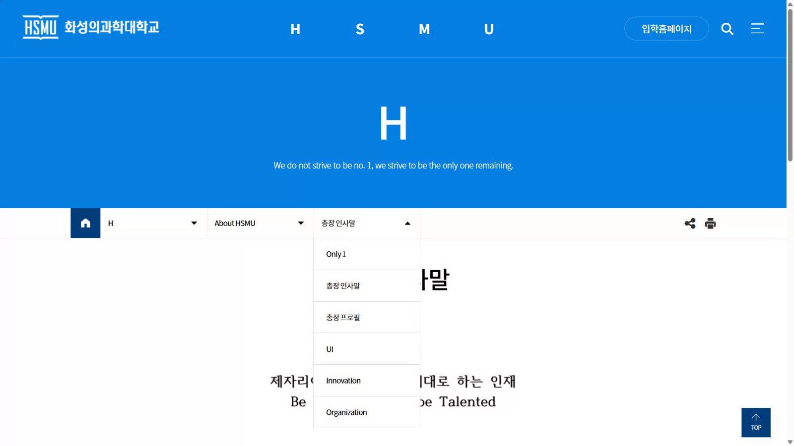
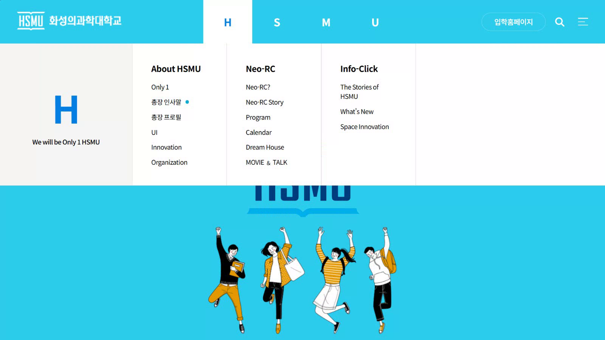

# Real browser pilot / 실제 브라우저 파일럿

2026-09-24 · HSMU public website · one run per arm / 방식별 1회

**Both tasks passed:** five model-selected clicks, three destination visits in order, and three independently checked facts. In this pair, JEV + Astra took 12.71 seconds versus Astra's 26.69 seconds and accounted for $0.01801461 versus $0.1424. This is a small project-authored pilot, not a universal performance claim.

**양쪽 업무가 통과했습니다.** 모델이 선택한 클릭 5회, 세 목적지의 순서대로 방문, 사실 3개의 독립 검증을 완료했습니다. 이번 두 실행에서 JEV + Astra는 12.71초·$0.01801461, Astra는 26.69초·$0.1424였습니다. 프로젝트가 직접 설계한 작은 파일럿이며 일반적인 성능 우위를 주장하지 않습니다.

## Results / 결과

| Measure / 항목 | Astra decisions + Astra extraction / Astra 판단·추출 | JEV decisions + Astra extraction / JEV 판단·Astra 추출 |
|---|---:|---:|
| Task outcome / 업무 결과 | Pass / 통과 | Pass / 통과 |
| Clicks / 클릭 | 5 | 5 |
| Ordered URL + heading visits / 순서·URL·제목 검증 | 3/3 | 3/3 |
| Facts / 사실 | 3/3 | 3/3 |
| Actual POSTs / 실제 POST | 7 | 7 |
| Task interval, including extraction / 추출 포함 업무 시간 | 26.690936 s | 12.711078 s |
| Browser navigation + decisions / 브라우저 이동·판단 | 23.210010 s | 9.889564 s |
| Final extraction / 최종 추출 | 3.474656 s | 2.815943 s |
| Setup, including initial navigation and popups / 최초 이동·팝업 포함 준비 | 8.364917 s | 10.041860 s |
| Cleanup / 정리 | 2.806045 s | 2.216533 s |
| Full process / 프로세스 전체 | 37.861897 s | 24.969471 s |
| Decision API cost / 판단 API 비용 | $0.12557000 reported / 보고 | $0.00118461 estimated / 추정 |
| Final Astra extraction cost / 최종 Astra 추출 비용 | $0.01683000 reported / 보고 | $0.01683000 reported / 보고 |
| Combined accounted API cost / 합산 계상 API 비용 | **$0.14240000** | **$0.01801461** |

The observed task-time ratio is **2.10×** and the accounted cost reduction is **87.35%**. Including setup/cleanup gives a **1.52×** full-process ratio. These are descriptive ratios from one sequential run per arm. Reported substeps differ slightly from the outer task interval because of host validation and measurement overhead.

관측된 업무 시간 비율은 **2.10배**, 계상 비용 감소율은 **87.35%**입니다. 준비·정리를 포함한 전체 프로세스 비율은 **1.52배**입니다. 순차적으로 방식별 한 번 실행한 값을 설명하는 비율입니다. 하위 구간과 외부 업무 시간의 작은 차이는 호스트 검증·계측 오버헤드입니다.

Raw evidence is preserved without changing answers or timing: [Astra report](astra/report.json), [JEV report](jev/report.json).

답이나 시간을 바꾸지 않은 원자료: [Astra 보고서](astra/report.json), [JEV 보고서](jev/report.json).

## Watch and inspect / 영상과 검토 근거

### One synchronized video / 하나의 동시 비교 영상

[](comparison/comparison.mp4)

**[▶ Play both together / 두 영상 동시에 재생](comparison/comparison.mp4)** · [Edit metadata / 편집 기록](comparison/comparison.json) · [Timer and end-state checks / 초 표시·종료 장면 확인](comparison/review.png)

Left is **NO JEV — Astra decisions + Astra extraction**; right is **WITH JEV — JEV decisions + Astra extraction**. This single 2560 × 1000 MP4 starts both complete clips together at 1×. The top counters show **video replay seconds**, separately from the static measured task times and API costs. Exact task-start frame alignment is unknown. No source footage is cut or sped up. After its clip ends, each counter stops and the last frame is held with an explicit label: Astra holds for 2.00 seconds and JEV for 14.48 seconds. Total edited duration is 33.96 seconds, including a final two-second presentation tail. No new API calls were made.

왼쪽은 **JEV 미사용 — Astra 판단·추출**, 오른쪽은 **JEV 사용 — JEV 판단·Astra 추출**입니다. 2560 × 1000 단일 MP4에서 두 원본을 처음부터 1배속으로 동시에 재생합니다. 상단의 움직이는 숫자는 **영상 재생 경과 초**이며, 별도 실측 업무 시간과 API 비용도 고정 표시합니다. 실제 업무 시작 프레임을 정확히 맞춘 영상은 아닙니다. 원본 구간 삭제나 배속은 없습니다. 먼저 끝난 쪽은 시계가 멈추고 종료 표시와 함께 마지막 화면을 유지합니다. 유지 구간은 Astra 2.00초, JEV 14.48초이며, 마지막 2초의 결과 표시를 포함한 전체 길이는 33.96초입니다. 추가 API 호출은 없습니다.

### Individual originals / 개별 원본

| Astra + Astra | JEV + Astra |
|---|---|
| [](astra/video.mp4) | [](jev/video.mp4) |
| [Full video / 전체 영상](astra/video.mp4) · [Contact sheet / 표본 모음](astra/contact-sheet.png) · [Media evidence / 영상 근거](astra/media.json) | [Full video / 전체 영상](jev/video.mp4) · [Contact sheet / 표본 모음](jev/contact-sheet.png) · [Media evidence / 영상 근거](jev/media.json) |

These are actual Playwright `recordVideo` viewport recordings from newly launched, visible Chrome windows at **1600 × 900**. They do not attach to the user's original tab or prove recovery of the native CUA connection. The full recorded streams retain visible initial white loading, popup preparation, waits and the final tail at **1×**, without cuts, synthetic page sequences or host-inference overlays.

Playwright `recordVideo`로 새로 띄운 Chrome의 **1600 × 900** 실제 뷰포트를 녹화했습니다. 사용자의 원래 탭에 연결한 영상이나 native CUA 연결 복구의 근거는 아닙니다. 초기의 흰 로딩 화면·팝업 준비·대기·마지막 후행 구간을 포함한 전체 기록을 **1배속**으로 유지했습니다. 잘라낸 구간·합성 페이지 순서·호스트 추론 오버레이는 없습니다.

All **799 Astra frames (31.96 s)** and **487 JEV frames (19.48 s)** were decoded. Every frame passed the nonblack luminance check, both black-interval lists were empty, and both five-frame samples contained five distinct images. Sampled frames were visually reviewed, including a denser JEV navigation storyboard showing greeting, submenu, profile and directions. Reviewed samples showed only the public site, with no accounts, keys or unrelated applications. This does not mean a human watched every frame.

Astra **31.96초·799프레임**, JEV **19.48초·487프레임**을 모두 디코딩했습니다. 모든 프레임이 비검정 밝기 검사를 통과했고 두 영상의 검은 구간 목록은 비어 있으며, 다섯 프레임 표본도 각각 모두 다른 이미지였습니다. 인사말·하위 메뉴·프로필·오시는 길을 보여주는 더 촘촘한 JEV 모음 이미지를 포함해 표본을 시각 검토했습니다. 검토한 표본에는 공개 사이트만 보이고 계정·키·다른 앱은 없었습니다. 사람이 모든 프레임을 봤다는 뜻은 아닙니다.

The first recorded-frame offset is unknown. Report offsets are estimates from page creation, not decoded video timestamps. Use the monotonic task timer in the reports; **do not equate video duration or its final frame with exact task time**. A video can be shorter than context wall time because recording begins after page creation has started. Pixel inspection proves neither task correctness nor total privacy by itself; the task report and sampled review are separate evidence.

첫 녹화 프레임의 시차는 미확정입니다. 보고서 오프셋은 페이지 생성 기준의 추정값이며 디코딩한 영상 타임스탬프가 아닙니다. 보고서의 단조 증가 업무 타이머를 사용하며, **영상 길이나 마지막 프레임을 정확한 업무 시간과 동일시하지 않습니다.** 페이지 생성이 시작된 후 녹화가 시작되므로 영상은 컨텍스트 경과 시간보다 짧을 수 있습니다. 픽셀 검사만으로 정답이나 완전한 개인정보 보호가 입증되는 것은 아니며 업무 보고서와 표본 검토를 별도 근거로 제공합니다.

## Matched protocol / 동일한 비교 조건

Both reports contain comparison hash:

두 보고서의 비교 해시:

```text
6c2d6b775d88e9492906f96d1e41b6043019657b534ed6b9a5bbdcff64a654c1
```

The hash covers the shared protocol and source hashes. Each arm has a fresh headed Chrome context, identical viewport, action choices, completion checks and limits. A shared preparation closes up to eight freshly observed popup `X` links before the task timer; both runs closed four, with zero model calls, and the preparation is recorded. Each task click is performed once, followed by `DOMContentLoaded` and a fresh observation. Both runs had **zero stale replans**.

해시는 공통 프로토콜과 소스 해시를 포함합니다. 방식별 새 Chrome 컨텍스트와 같은 뷰포트·행동 선택지·완료 검사·한도를 사용했습니다. 공통 준비는 새로 관측한 팝업 `X` 링크를 최대 여덟 번 닫고 타이머를 시작합니다. 두 실행 모두 네 개를 닫았고 모델 호출은 0회였으며 이 과정도 녹화했습니다. 업무의 각 클릭은 한 번 실행한 뒤 `DOMContentLoaded`와 새 관측을 기다렸습니다. 두 실행 모두 **오래된 관측으로 인한 재계획은 0회**였습니다.

The known host-authored route was `H` → greeting → greeting submenu → profile → directions. Greeting/profile image contents were **not read**. The final Astra call extracted text facts: Seoul Station bus `5101`, phone `031-369-9100~1`, shuttle fare `무료`. All values matched the frozen local labels. Each arm made six decision requests (five clicks and DONE), then one Astra extraction request. Models were `openai/gpt-6-astra` and pinned `jev-1.13.0`.

호스트가 미리 작성한 경로는 `H` → 인사말 → 인사말 하위 메뉴 → 프로필 → 오시는 길입니다. 인사말·프로필 이미지 내용은 **읽지 않았습니다.** 마지막 Astra가 텍스트에서 서울역 버스 `5101`, 전화 `031-369-9100~1`, 셔틀 요금 `무료`를 추출했고 확정된 로컬 기대값과 모두 일치했습니다. 각 방식은 판단 6회(클릭 5회와 DONE) 후 Astra 추출 1회를 호출했습니다. 모델은 `openai/gpt-6-astra`와 고정된 `jev-1.13.0`입니다.

`cacheMode: "off"` requests no explicit prompt-cache breakpoint, not a guaranteed cache bypass. OpenRouter reported zero cached/write tokens for the measured Astra calls. Fresh browser contexts do not prove all OS/network/site/provider caches were cold. No exact-result replay was substituted for either task.

`cacheMode: "off"`는 명시적 프롬프트 캐시 경계를 요청하지 않는다는 뜻이며 강제 캐시 우회를 보장하지 않습니다. 이번 Astra 호출에서는 OpenRouter가 캐시 읽기·쓰기 토큰을 0으로 보고했습니다. 새 브라우저 컨텍스트만으로 운영체제·네트워크·사이트·공급자 캐시가 모두 비어 있었다고 할 수 없습니다. 두 업무를 정확 결과 재생으로 대체하지 않았습니다.

## Accounting and retained failures / 비용과 보존한 실패

| Scope / 범위 | POSTs | Accounted API cost / 계상 API 비용 |
|---|---:|---:|
| Successful new pair / 새 성공 비교 두 건 | 14 | $0.160414610 |
| Earlier six native-CUA diagnostics / 이전 native CUA 진단 여섯 건 | 23 | $0.849577356 |
| This browser investigation, combined / 이번 브라우저 조사 합계 | **37** | **$1.009991966** |

OpenRouter costs are reported account credits. JEV's $0.00118461 is an estimate for **28,205 input tokens** at the recorded list-price rate of **$0.042 per million**, verified in the report on 2026-09-24. Upstream inference cost is not added a second time. Cash charge remains unknown; host inference/subscriptions, funding fees, tax and local compute/network expenses are excluded. Unrelated earlier product experiments are outside this total.

OpenRouter 비용은 보고된 계정 크레딧입니다. JEV의 $0.00118461은 **입력 28,205토큰**에 보고서의 **100만 토큰당 $0.042** 정가(보고서 확인일 2026-09-24)를 적용한 추정입니다. 상위 공급자 추론 비용을 다시 더하지 않았습니다. 카드 청구액은 미확정이며 호스트 추론·구독, 충전 수수료·세금, 로컬 컴퓨터·네트워크 비용은 제외합니다. 무관한 이전 제품 실험은 이 합계의 범위 밖입니다.

The [earlier diagnostic summary](diagnostics/summary.json) retains six attempts and their costs. One Astra attempt passed; no JEV attempt succeeded and the desktop capture was black, so that group is not a valid successful video comparison. The attempts span a cross-realm JSON parsing defect and an old persistent-runtime closure with an effective five-second observation deadline. The new CLI uses a fresh process and freezes actual source hashes.

[이전 진단 요약](diagnostics/summary.json)은 여섯 시도와 비용을 보존합니다. Astra 한 번은 통과했지만 JEV는 성공하지 못했고 데스크톱 녹화가 검은 화면이어서 유효한 성공 비교 영상이 아닙니다. 서로 다른 JS realm의 JSON 파싱 결함과, 실제 관측 제한 시간이 5초로 남아 있던 오래된 영속 런타임 클로저 문제가 포함됩니다. 새 CLI는 새 프로세스에서 실행하고 실제 소스 해시를 확정합니다.

Four free preflights, including failures, are preserved: [1](preflight-1/report.json), [2](preflight-2/report.json), [3](preflight-3/report.json), [4](preflight-4/report.json). All had zero paid API calls; **the fourth** passed the five-click/three-visit path. Its capture was 17.28 seconds / 432 frames with no detected black interval. Earlier diagnosis also found that page scripts replaced `window.Map`, breaking structured object transport; bounded JSON-text transport and strict host validation fixed that path. The smaller 11.6-second capture check was a separate diagnostic, not a full task result.

실패를 포함한 무료 사전 검사 네 번을 보존합니다: [1](preflight-1/report.json), [2](preflight-2/report.json), [3](preflight-3/report.json), [4](preflight-4/report.json). 모두 유료 API 호출은 0회였고 **네 번째**가 다섯 클릭·세 목적지 방문을 통과했습니다. 그 녹화는 17.28초·432프레임이며 검은 구간이 검출되지 않았습니다. 앞선 진단에서는 페이지가 `window.Map`을 덮어써 객체 전달을 방해하는 문제도 확인했고, 크기가 제한된 JSON 문자열 전달과 호스트의 엄격한 검증으로 수정했습니다. 더 짧은 11.6초 캡처 검사는 별도 진단이며 전체 업무 성공 결과가 아닙니다.

## Reproduce and interpret / 재현과 해석

See [English instructions](../../../docs/BROWSER-DEMO.en.md) / [한국어 실행 방법](../../../docs/BROWSER-DEMO.ko.md). The original browser-run verification passed **778 offline tests**; the current release test count is in the repository README. This does not prove production readiness for arbitrary tasks or Claude/Grok integration. The site, finite route and scoring were authored/selected by this project; the model did not discover an unrestricted new workflow. One sequential run per arm is not an independent or statistically conclusive benchmark.

[영어 실행 방법](../../../docs/BROWSER-DEMO.en.md) / [한국어 실행 방법](../../../docs/BROWSER-DEMO.ko.md)을 제공합니다. 원본 브라우저 실험 당시 검증은 **오프라인 테스트 778개 통과**였으며, 현재 릴리스의 테스트 수는 저장소 README에 기록합니다. 임의 업무의 운영 준비나 Claude/Grok 연동을 입증하지 않습니다. 사이트·유한 경로·채점 기준은 이 프로젝트가 선택·작성했으며 모델이 제한 없는 새 업무 경로를 발견한 실험이 아닙니다. 방식별 한 번의 순차 실행은 독립적이거나 통계적으로 결론을 낼 수 있는 벤치마크가 아닙니다.
